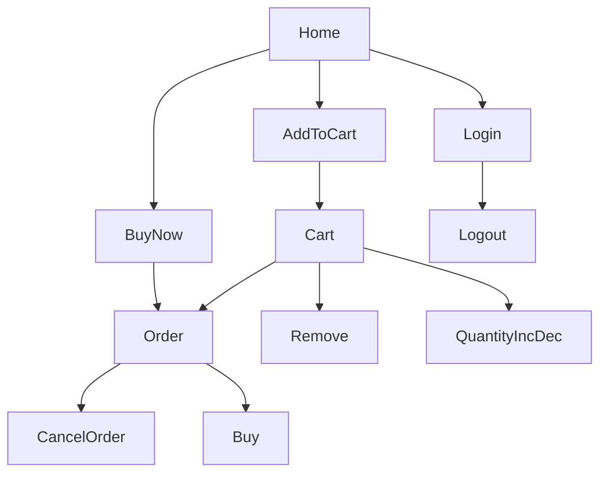

# Online Shopping Project

This is my first project. It performs most of the functions which we use in our daily life while buying a product from a website.

### Language and Database Used
👉Java language

👉MySql database management system

### Functions
1. Login
2. Logout
3. Add to cart
4. Buy Now
5. Order Now
6. Check out
7. Quantity Increment and Decrement
8. Remove from cart
9. Cancel Order

### Here is a simple flow chart

